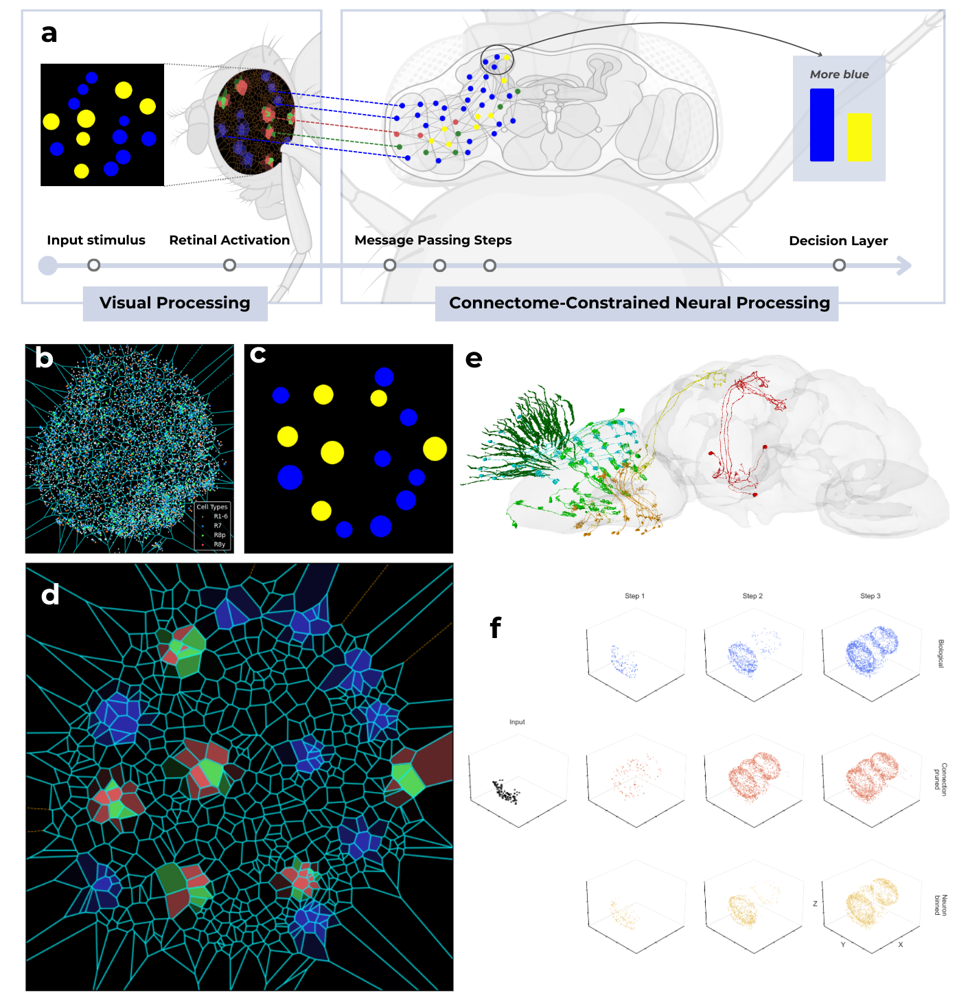
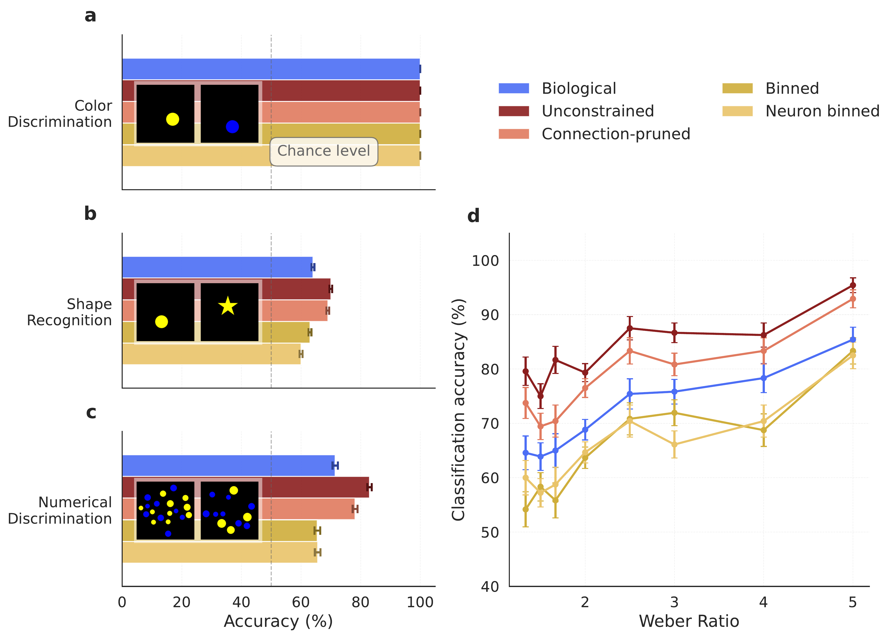
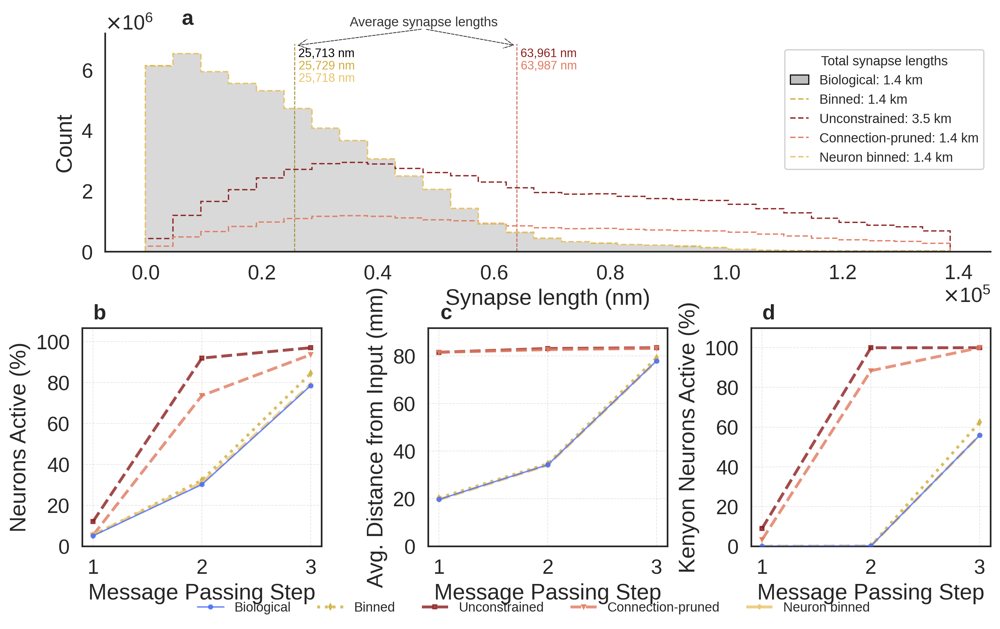

# *Drosophila melanogaster* connectome models

[](https://doi.org/10.5281/zenodo.21549559)
[](LICENSE)


**Does the measured wiring of a brain, on its own, support useful computation?** This repository holds the experiments, analysis notebooks, and figure code behind *Structure alone supports efficient visual computation in the Drosophila visual system* (Eudald Correig-Fraga, Roger Guimerà, and Marta Sales-Pardo). We take the proofread adult fruit fly connectome, attach an anatomically faithful model of its compound eye, and train it to see. The anatomical graph and the eye geometry stay fixed: only a scalar gain per synapse and a linear readout are learned. We then ask whether the real wiring beats randomized wirings that respect the same biological constraints.

The core model lives in the [train-your-fly](https://github.com/eudald-seeslab/train-your-fly) package. Stimuli are generated with [cogstim](https://github.com/eudald-seeslab/cogstim). This repository is the study-specific layer on top of both: training scripts, connectome randomizers, model inspection, and paper figures.



*From pixels to a decision. **a,** An image is sampled by the reconstructed ommatidia, converted into photoreceptor activations, propagated through the connectome by message passing, and read out from Kenyon cells in the mushroom body. **b–d,** Example stimulus, photoreceptor terminals of the right eye with their Voronoi tessellation, and the resulting retinal activation. **e,** A sample of retina, lamina, medulla, lobula, lobula plate, and Kenyon-cell neurons rendered with [Codex](https://codex.flywire.ai/). **f,** Neurons active after each message-passing step for the biological graph and two randomized ensembles.*

## The model in one paragraph

We use the FlyWire whole-brain connectome, version 783, with 139,255 proofread neurons and 54.5 million synaptic contacts. Photoreceptor terminals (R1-6, R7, R8) are projected onto a plane, and a Voronoi tessellation seeded at the R7 positions defines one catchment region per ommatidium. Every input image is averaged inside each region, and each photoreceptor type reads the channel matching its spectral sensitivity. These retinal activations then propagate through the graph for a small number of message-passing steps. At each step a neuron sums the activity of its presynaptic partners, weighted by the anatomical synapse count and a learned gain bounded in [-1, 1], and applies a tanh nonlinearity. After the last step, the population activity of the Kenyon cells is passed to a linear classifier.

## What the fly can do

The model learns three visual tasks from synthetic 512×512 images: **colour discrimination** (yellow vs. blue), **shape recognition** (circle vs. star, trained on the left half of the visual field and tested on the right half), and **numerical discrimination** (which colour has more dots, with total surface area equalized so that area cannot be used as a cue).



*Performance of the biological connectome and four randomized ensembles. **a,** All models solve colour discrimination. **b,** Shape recognition transfers across the visual field above chance. **c–d,** The shape task is trained on one half of the visual field and tested on the other. **e–f,** Numerical discrimination improves with the Weber ratio between the two dot counts, the signature of an approximate number system. Bars show mean ± 95% CI; the dashed line is chance.*

## Is the real wiring special?

To test whether precise connectivity matters under a wiring budget, we compare the biological graph with four randomized ensembles that preserve increasingly more of its structure:

| Ensemble | What is preserved | Total wiring | Mean synapse length |
| --- | --- | --- | --- |
| **Unconstrained** | Out-degree of every neuron | 2.5× biological | 2.5× biological |
| **Connection-pruned** | Out-degree, then pruned to the biological wiring budget | = biological | above biological |
| **Synapse-bin** | Global distribution of connection lengths | = biological | = biological |
| **Neuron-bin** | Per-neuron distribution of outgoing connection lengths; only weights are reshuffled | = biological | = biological |



*Randomized ensembles and how activity spreads through them. **a–e,** Toy illustrations of the five graphs. **f,** Synapse-length distributions; the two least constrained ensembles more than double the average synapse length. **g–i,** Fraction of active neurons, fraction of active Kenyon cells, and mean distance of activity from the input at each message-passing step. **j,** 3D positions of active neurons after each step.*

At matched wiring cost, the biological network is consistently the most accurate. Rewirings that ignore spatial constraints surpass it, but only by inflating the wiring budget or by favouring long-range connections that let activity reach the Kenyon cells in fewer steps. The measured connectivity and the eye geometry therefore jointly set an efficient operating point for visual computation.

## Repository structure

```
connectome/
├── connectome/              # Importable library code
│   ├── randomizers/         # The four connectome randomization strategies
│   ├── model_inspection/    # Neuron-level and manifold inspection utilities
│   ├── visualization/       # Plot helpers shared by the notebooks
│   └── data_helpers.py
├── configs/                 # Experiment configuration (config.py, sweeps, multitask dirs)
├── training/                # train.py, train_multitask.py, sweep.py, benchmark_speed.py
├── random_networks/         # Random-graph generation, wiring-length and Weber-ratio analyses
├── manifolds/               # Representation (manifold) analyses of Kenyon-cell activity
├── model_inspection/        # Notebooks that open trained models and look inside
├── paper_figures/           # Notebooks that build the paper figures
├── plots/                   # Rendered figures (PNG and PDF)
├── data_processing/         # Notebooks that prepare connectome and image data
├── zenodo/                  # Scripts and documentation for the archived data record
└── tests/
```

This layout follows the needs of one study. If you want to train your own fly, start from [train-your-fly](https://github.com/eudald-seeslab/train-your-fly) and use this repository as a worked example.

## Installation

1. Clone the repository:

```bash
git clone https://github.com/eudald-seeslab/connectome.git
cd connectome
```

2. Create and activate a virtual environment:

```bash
python -m venv venv
source venv/bin/activate
```

3. Install PyTorch and PyTorch Geometric for your CUDA version, following the [PyTorch](https://pytorch.org/get-started/locally/) and [PyG](https://pytorch-geometric.readthedocs.io/en/latest/install/installation.html) instructions. The paper used `torch==2.6.0`, `torch-geometric==2.6.1`, `torch-scatter==2.1.2`, and `torch-sparse==0.6.18`; `requirements.txt` pins the full environment. A CUDA `dockerfile` is also provided.

4. Install `train-your-fly` (editable, from a local clone):

```bash
pip install -e /path/to/train-your-fly
```

5. Install this package:

```bash
pip install -e .
```

With research tools (plotly, numba, umap, scikit-learn, etc.):

```bash
pip install -e .[research]
```

Full (research + dev):

```bash
pip install -e .[all]
```

## Data

**Connectome.** The model reads from `new_data/` in the project root: `connections.csv` (`pre_root_id`, `post_root_id`, `syn_count`), `classification.csv` (`root_id`, `cell_type`, `side`), `right_visual_positions_all_neurons.csv` (projected photoreceptor coordinates), and `rational_cell_types.csv`. Randomized graphs are read from `connections_random_<strategy>.csv`. The exact biological and randomized graphs used in the paper, the annotation table, and the photoreceptor mapping are archived on Zenodo at [10.5281/zenodo.21549559](https://doi.org/10.5281/zenodo.21549559). The notebooks in `data_processing/` show how they were derived from the FlyWire v783 release and the [FlyWire annotations v2.1.0](https://github.com/flyconnectome/flywire_annotations/releases/tag/v2.1.0).

**Stimuli.** Images live in `images/<task>/train/<class>/` and `images/<task>/test/<class>/`. Generate them with [cogstim](https://github.com/eudald-seeslab/cogstim):

```bash
pip install cogstim
cogstim shapes --train-num 60 --test-num 20
cogstim colours --train-num 60 --test-num 20 --no-jitter
cogstim ans --ratios easy --train-num 100 --test-num 40
```

The paper used 5,000 training, 5,000 validation, and 5,000 test images per class. See the [cogstim documentation](https://github.com/eudald-seeslab/cogstim) for all tasks and options.

## Training

Adjust parameters in `configs/config.py`, then:

```bash
python training/train.py
```

The switches that matter most are `data_type` (which image folder to train on), `NUM_CONNECTOME_PASSES`, `train_edges` / `train_neurons` (which parameters are learned), and `randomization_strategy` (`None` for the biological graph, or `unconstrained`, `conn_pruned`, `binned`, `neuron_binned`). Runs are logged to [Weights & Biases](https://wandb.ai/) when `wandb_` is enabled.

For multitask training, also configure `configs/config_multitasking_dirs.py`:

```bash
python training/train_multitask.py
```

For hyperparameter sweeps defined in `configs/sweep_definitions.py`:

```bash
python training/sweep.py --sweep regularisation
```

## Randomized connectomes

The four randomization strategies are implemented in `connectome/randomizers/` and driven from `random_networks/random_networks.ipynb`. Wiring-length statistics, sanity checks, and the Weber-ratio comparison across ensembles are in the same folder. Because each randomization is a single sampled instance, the exact graph files used in the paper are included in the Zenodo record rather than regenerated.

## Reproducing the paper

| Figure | Where it is made |
| --- | --- |
| Fig. 1 | Schematic assembled from `plots/input_tesselation.png`, `plots/neural_activation.png`, and `plots/activation_evolution.png` |
| Fig. 2 | `paper_figures/randomization_strategies_figure.ipynb`, `paper_figures/figure_2.ipynb` |
| Fig. 3 | `paper_figures/figure_3.ipynb` (source data in `zenodo/`) |

The scripts in `zenodo/` build the archived data record from the trained-model predictions, and `zenodo/DATA_README.md` and `zenodo/DATA_DICTIONARY.md` document every file. The archived code versions are `connectome` commit `93476a2`, `train-your-fly` commit `733a8bd`, and `cogstim` commit `e61ebf1`.

## Citation

If you use this code or the archived data, please cite the manuscript and the data record:

> Correig-Fraga, E., Guimerà, R., & Sales-Pardo, M. *Structure alone supports efficient visual computation in the Drosophila visual system.*
>
> Correig-Fraga, E., Guimerà, R., & Sales-Pardo, M. (2026). Data and source data for "Structure alone supports efficient visual computation in the Drosophila visual system" (v1.0.0). Zenodo. https://doi.org/10.5281/zenodo.21549559

Please also cite the upstream FlyWire resources ([Dorkenwald et al., 2024](https://doi.org/10.1038/s41586-024-07558-y); [Schlegel et al., 2024](https://doi.org/10.1038/s41586-024-07686-5)).

## Troubleshooting

Some weird bug sometimes makes CUDA break. You can fix it with:

```bash
sudo rmmod nvidia_uvm
sudo modprobe nvidia_uvm
```

## License

[MIT](LICENSE). The FlyWire-derived data keep their own CC BY 4.0 licence.
